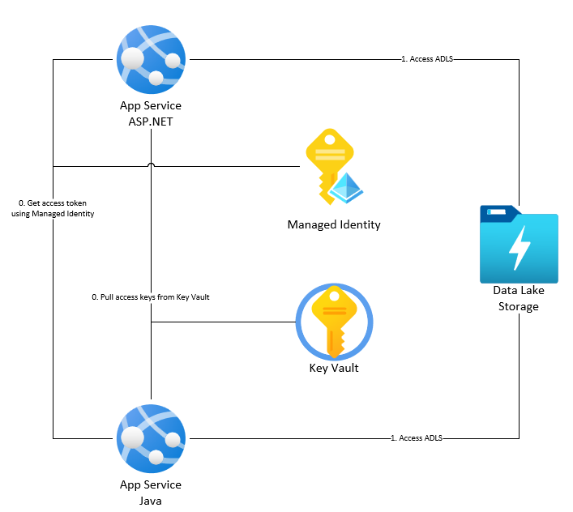
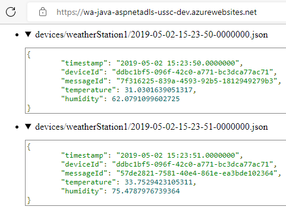
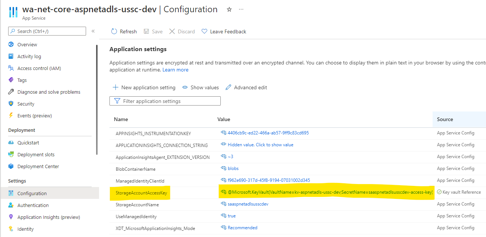

# aspnet-adls

This repo shows you how to build an ASP.NET Core & Java Spring application and access Azure Data Lake Store (ADLS). The code shows you both how to access the ADLS using Storage Account keys and how to access the ADLS using a managed identity.



Here is a screenshot of the Java application accessing the ADLS & display the JSON contents of the files.



## Accessing Storage Account using Storage Account Access Keys

In this example, the Storage Account Access Keys are stored in Azure Key Vault and accessed as environment variables in the App Service the application is running as.

### ASP.NET Core

In the ASP.NET Core example, a singleton service of type `DataLakeServiceClient` is added to the middleware at startup time so the application can use it later on. Look in the `/src/aspnet/Program.cs` file.

```cs
StorageSharedKeyCredential sharedKeyCredential = new StorageSharedKeyCredential(
    builder.Configuration["StorageAccountName"],
    builder.Configuration["StorageAccountAccessKey"]);

  builder.Services.AddSingleton(new DataLakeServiceClient(
    new Uri($"https://{builder.Configuration["StorageAccountName"]}.dfs.core.windows.net"),
    sharedKeyCredential));
```

These configuration values are populated by App Service at startup time.



In the controller `/src/aspnet/Controllers/HomeController.cs`, we can get this service and connect to the ADLS.

```cs
public HomeController(ILogger<HomeController> logger, DataLakeServiceClient dataLakeServiceClient, IConfiguration configuration)
{
    _logger = logger;
    _dataLakeServiceClient = dataLakeServiceClient;
    _configuration = configuration;
}

public async Task<IActionResult> Index()
{
    List<JsonFile> jsonFiles = new List<JsonFile>();

    var fileSystemClient = _dataLakeServiceClient.GetFileSystemClient(_configuration["BlobContainerName"]);

    await foreach (var path in fileSystemClient.GetPathsAsync("/", true))
    {
        if (path.IsDirectory == false)
        {
            var fileClient = fileSystemClient.GetFileClient(path.Name);
            var fileStream = fileClient.OpenRead();
            var streamReader = new StreamReader(fileStream);
            jsonFiles.Add(new JsonFile
            {
                Name = path.Name,
                Content = await streamReader.ReadToEndAsync()
            });

        }
    }

    ViewBag.JsonFiles = jsonFiles;

    return View();
}
```

Finally, we can render the JSON files in the view `/src/aspnet/Views/Home/Index.cshtml`.

```html
<script src="https://cdn.jsdelivr.net/gh/google/code-prettify@master/loader/run_prettify.js"></script>
<div>
  <ul>
    @foreach (var jsonFile in ViewBag.JsonFiles) {
    <li>
      <details>
        <summary>@jsonFile.Name</summary>
        <pre class="prettyprint"><code>@jsonFile.Content</code></pre>
      </details>
    </li>
    }
  </ul>
</div>
```

### Java

The Java example is similar to the ASP.NET Core example. The environment variables are read in using a POJO.

Look in the `src/java/src/main/resources/application.properties` file to see how these get mapped from the App Service configuration to Java.

```java
azure.blobContainerName=${BlobContainerName}
azure.managedIdentityClientId=${ManagedIdentityClientId}
azure.storageAccountAccessKey=${StorageAccountAccessKey}
azure.storageAccountName=${StorageAccountName}
azure.useManagedIdentity=${UseManagedIdentity}
```

These will get automatically populated by Spring at startup time. Look in the `src/java/src/main/java/com/microsoft/azure/aspnetadls/ConfigProperties.java`.

```java
@Configuration
@ConfigurationProperties(prefix = "azure")
public class ConfigProperties {
private String blobContainerName;

public String getBlobContainerName() {
  return blobContainerName;
}

public void setBlobContainerName(String blobContainerName) {
  this.blobContainerName = blobContainerName;
}
...
```

We can instantiate the `DataServiceClient` in a Service so it can be used in other code. Look in the `src/java/src/main/java/com/microsoft/azure/aspnetadls/service/DataLakeServiceClientService.java` file.

```java
@Service
public class DataLakeServiceClientService {
  private ConfigProperties configProperties;

  @Autowired
  public void setConfigProperties(ConfigProperties configProperties) {
    this.configProperties = configProperties;
  }

  @PostConstruct
  public DataLakeServiceClient getDataLakeServiceClient() {
    String endpoint = "https://" + configProperties.getStorageAccountName() + ".dfs.core.windows.net";
    DataLakeServiceClient dataLakeServiceClient;
    ...
    StorageSharedKeyCredential sharedKeyCredential = new StorageSharedKeyCredential(
        configProperties.getStorageAccountName(), configProperties.getStorageAccountAccessKey());

    DataLakeServiceClientBuilder builder = new DataLakeServiceClientBuilder();

    builder.credential(sharedKeyCredential);
    builder.endpoint(endpoint);

    dataLakeServiceClient = builder.buildClient();
    return dataLakeServiceClient;
  }
}
```

We can now use it to access the ADLS in the `HomeService`. Look in the `src/java/src/main/java/com/microsoft/azure/aspnetadls/service/HomeService.java` file.

```java
@Service
public class HomeService {
  ...
  private DataLakeServiceClientService dataLakeServiceClientService;

  @Autowired
  public void setDataLakeServiceClientService(DataLakeServiceClientService dataLakeServiceClientService) {
    this.dataLakeServiceClientService = dataLakeServiceClientService;
  }

  public Vector<JsonFile> getJsonFiles() {
    Vector<JsonFile> jsonFiles = new Vector<JsonFile>();

    var dataLakeServiceClient = dataLakeServiceClientService.getDataLakeServiceClient();

    var fileSystemClient = dataLakeServiceClient.getFileSystemClient(configProperties.getBlobContainerName());

    for (var path : fileSystemClient.listPaths(new ListPathsOptions().setPath("/").setRecursive(true), null)) {
      if (path.isDirectory() == false) {
        var fileClient = fileSystemClient.getFileClient(path.getName());
        var fileStream = fileClient.openInputStream();
        var jsonFile = new JsonFile();
        jsonFile.setName(path.getName());
        try {
          jsonFile.setContent(new String(fileStream.getInputStream().readAllBytes(), StandardCharsets.UTF_8));
        } catch (Exception e) {
          jsonFile.setContent("Unable to load file");
        }
        jsonFiles.add(jsonFile);
      }
    }

    return jsonFiles;
  }
}
```

Now the controller can request data from the ADLS using the `HomeService`. Look in the `src/java/src/main/java/com/microsoft/azure/aspnetadls/controller/HomeController.java` file.

```java
@Controller
public class HomeController {
  @Autowired
  HomeService homeService;

  @GetMapping("/")
  public String index(ModelMap model) {
    Vector<JsonFile> jsonFiles = new Vector<JsonFile>();
    jsonFiles = homeService.getJsonFiles();
    model.put("jsonFiles", jsonFiles);
    return "index";
  }
```

Finally, we can render the results in the view. Look in the `src/java/src/main/webapp/WEB-INF/templates/index.html` file.

```html
<script src="https://cdn.jsdelivr.net/gh/google/code-prettify@master/loader/run_prettify.js"></script>
<div>
  <ul>
    <c:forEach items="${jsonFiles}" var="jsonFile">
      <li th:each="jsonFile: ${jsonFiles}">
        <details>
          <summary th:text="${jsonFile.getName()}" />
          <pre
            class="prettyprint"
          ><code th:text="${jsonFile.getContent()}" /></pre>
        </details>
      </li>
    </c:forEach>
  </ul>
</div>
```

## Accessing Storage Account using a managed identity

Using a Managed Identity simplifies both the code & the infrastructure since there are no secrets to store in Key Vault and manage. The application will get a token at runtime and access to ADLS.

### ASP.NET Core

```cs
TokenCredential tokenCredential = new DefaultAzureCredential(new DefaultAzureCredentialOptions
  {
    ManagedIdentityClientId = builder.Configuration["ManagedIdentityClientId"]
  });

builder.Services.AddSingleton(new DataLakeServiceClient(
  new Uri($"https://{builder.Configuration["StorageAccountName"]}.dfs.core.windows.net"),
  tokenCredential));
```

### Java

```java
DefaultAzureCredential defaultAzureCredential = new DefaultAzureCredentialBuilder()
    .managedIdentityClientId(configProperties.getManagedIdentityClientId())
    .build();

DataLakeServiceClientBuilder builder = new DataLakeServiceClientBuilder();
dataLakeServiceClient = builder.credential(defaultAzureCredential).endpoint(endpoint).buildClient();
```

## Disclaimer

**THE SOFTWARE IS PROVIDED "AS IS", WITHOUT WARRANTY OF ANY KIND, EXPRESS OR IMPLIED, INCLUDING BUT NOT LIMITED TO THE WARRANTIES OF MERCHANTABILITY, FITNESS FOR A PARTICULAR PURPOSE AND NONINFRINGEMENT. IN NO EVENT SHALL THE AUTHORS OR COPYRIGHT HOLDERS BE LIABLE FOR ANY CLAIM, DAMAGES OR OTHER LIABILITY, WHETHER IN AN ACTION OF CONTRACT, TORT OR OTHERWISE, ARISING FROM, OUT OF OR IN CONNECTION WITH THE SOFTWARE OR THE USE OR OTHER DEALINGS IN THE SOFTWARE.**

## Deployment

### Azure Infrastructure

1.  Modify the `/infra/env/dev.parameters.json` file to match your environment.

1.  Run the following command to deploy your Azure application. Note that you need to decide if you want to enable the Managed Identity to access the ADLS. If so, you should set the `shouldEnableManagedIdentity` flag to `true` (you will need **Owner** access to deploy this code in this case).

    ```shell
    az deployment group create -g rg-aspnet-adls-ussc-dev --template-file ./infra/main.bicep --parameters ./infra/env/dev.parameters.json --parameters shouldEnableManagedIdentity=false
    ```

### ASPNET Core

1.  Run the following commands to build, publish & zip up your ASPNET Core app.

    ```shell
    dotnet publish
    Compress-Archive ./bin/Debug/net6.0/publish/* ../app.zip -Update
    ```

1.  Run the following commands to deploy your ASPNET Core app to Azure App Service (modify the resource group name & app name as needed).

    ```shell
    az webapp deployment source config-zip --resource-group rg-aspnet-adls-ussc-dev --name wa-net-core-aspnetadls-ussc-dev --src ../app.zip
    ```

### Java

1.  Navigate to the `/src/java/build.gradle` file and update the `azurewebapp` settings as appropriate for your environment.

1.  Run the following code to build & deploy your Java app to Azure App Service.

    ```shell
    gradle azureWebAppDeploy
    ```

## Links

- [Azure Data Lake Storage](https://docs.microsoft.com/en-us/azure/data-lake-store/data-lake-store-overview)
- [Azure Data Lake Storage Client Library](https://docs.microsoft.com/en-us/azure/data-lake-store/data-lake-store-client-libraries)
- [Azure Data Lake Storage Client Library for Java](https://docs.microsoft.com/en-us/java/api/overview/azure/storage-file-datalake-readme?view=azure-java-stable)
- [Azure Data Lake Storage Client Library for C#](https://docs.microsoft.com/en-us/azure/data-lake-store/data-lake-store-data-operations-net-sdk)
- [Java SDK Managed Identity Authentication](https://docs.microsoft.com/en-us/azure/developer/java/sdk/identity-azure-hosted-auth)
